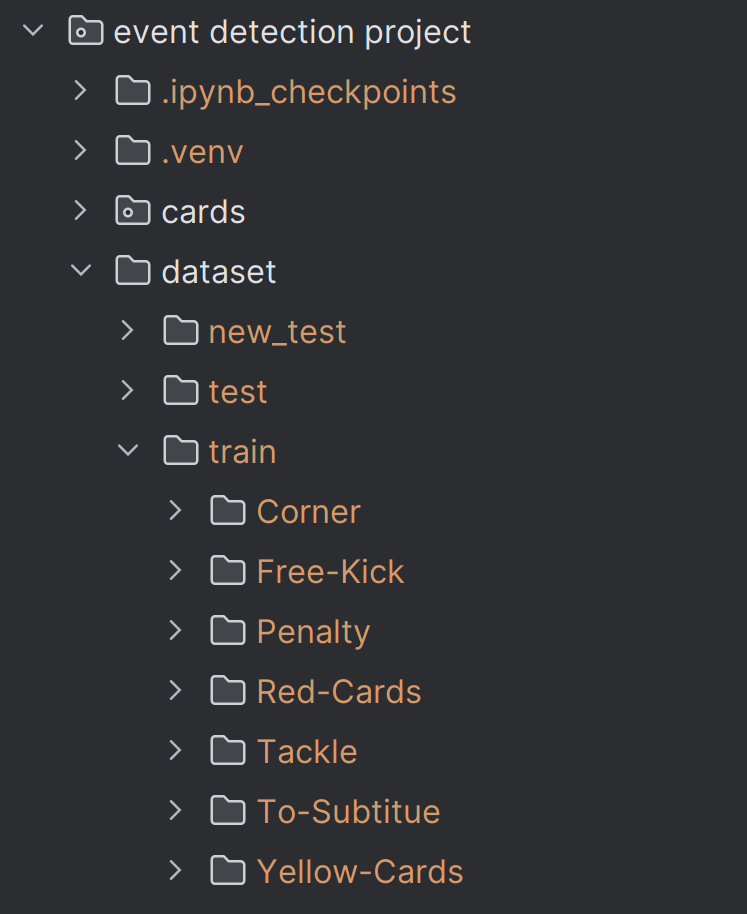
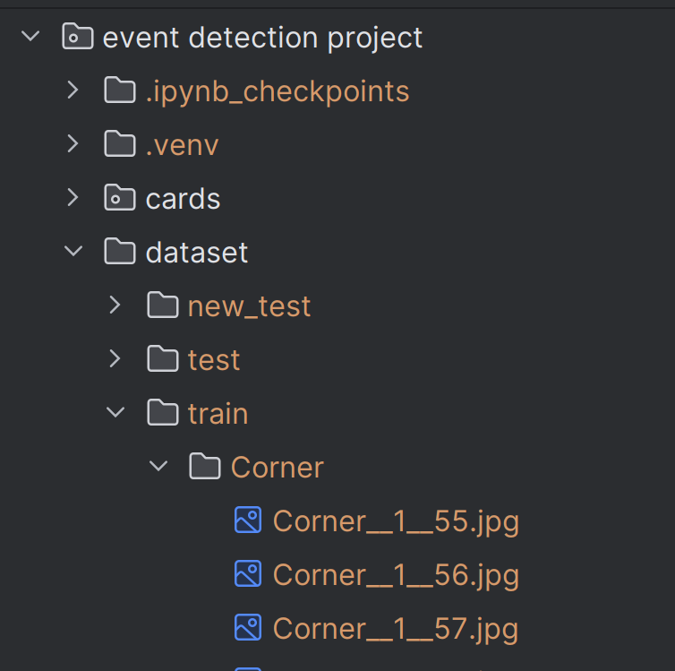
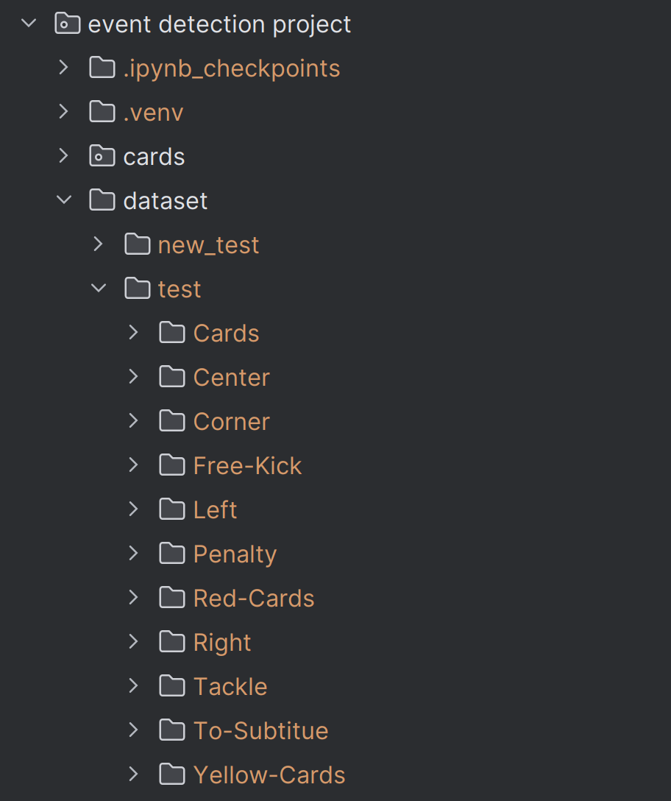
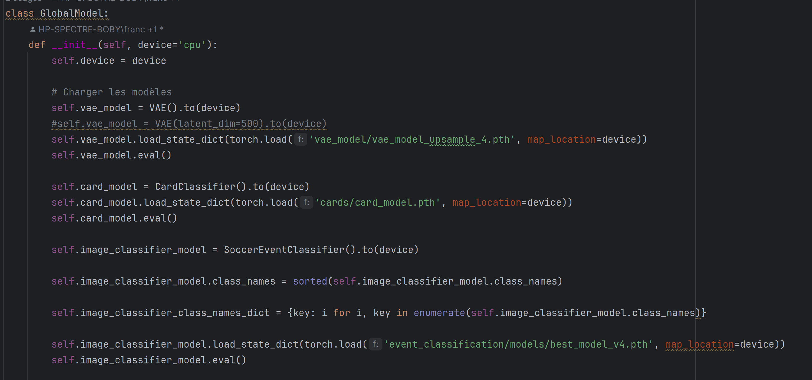

# Setup

- Installer Python (on a utilisé la version **3.12.10**)

- Créer et activer l'environement virtuel

`py -m venv .venv`

`.venv\Scripts\activate`

- Installer les packages du requirements.txt

`pip install -r requirements.txt`

source: https://packaging.python.org/en/latest/guides/installing-using-pip-and-virtual-environments/

- Créer le kernel et choisir l'environement virtuel depuis jupyter notebook

source: https://www.geeksforgeeks.org/using-jupyter-notebook-in-virtual-environment/

NB: J'ai du installer _ipython_ et _ipykernel_ avec ces commandes:

`pip install ipython`

`pip install ipykernel`

avant de rouler la commande de l'article:

`ipython kernel install --user --name=.venv`

# Entrainement des modèles

## VAE

- Télécharger les données ici: https://drive.google.com/drive/folders/1jzt7g0KqFNTshEAau95aScPWin55g31E

- Créer un dossier **train** dans le dossier **dataset** et y transférer les données d'entrainement des 7 catégories principales **(corner, free-kick, penalty, red-cards, tackle, to-subtitue, yellow-cards)**. On obtient cette hiérarchie:

- Ouvrir le notebook **vae_model/main.ipynb** et rouler le code pour entrainer un modèle VAE. Le modèle sera sauvegardé dans un fichier .pth. Ce fichier pourra être utilisé
ultérieurement pour l'évaluation du modèle global.

## Modèle de classification des evenements
### entrainement
- Télécharger les données ici: https://drive.google.com/drive/folders/1jzt7g0KqFNTshEAau95aScPWin55g31E

- Créer un dossier **train** dans un dossier de votre choix et transferer les y transférer les données d'entrainement des 10 catégories principales **(corner, free-kick, penalty, red-cards, tackle, to-subtitue, yellow-cards,left,center,right)**

- Ouvrir le notebook **event_classification/train.ipynb** et rouler le code pour entrainer le modele de Classification des évenements. Il vous sera demandé de fournir le chemin des données que vous voulez entraîner. Le modèle sera sauvegardé dans un fichier .pth. Ce fichier pourra être utilisé
ultérieurement pour l'évaluation du modèle global.

### entrainement
- Télécharger les données ici: https://drive.google.com/drive/folders/1jzt7g0KqFNTshEAau95aScPWin55g31E

- Créer un dossier **test** dans un dossier de votre choix et transferer les y transférer les données d'entrainement des 10 catégories principales **(corner, free-kick, penalty, red-cards, tackle, to-subtitue, yellow-cards,left,center,right)**

- Ouvrir le notebook **event_classification/model_eval.ipynb** et rouler le code pour entrainer le modele de Classification des évenements. Il vous sera demandé de fournir le chemin des données et le chemin du modèle que vous voulez tester qui se trouve dans **event_classification/models/** que vous voulez essayer (il y'en a 2).

## Modèle des cartons

# Evaluation du modèle global

- Créer un dossier **test** dans le dossier **dataset** et y transférer la totalité des données de test récupérés ici: https://drive.google.com/drive/folders/1jzt7g0KqFNTshEAau95aScPWin55g31E. On obtient cette hiérarchie:

- Consulter le fichier **global_model.py** et s'assurer que les fichiers des modèles sont bien référencés

- Rouler le notebook **main.ipynb** à la racine pour évaluer le modèle global
