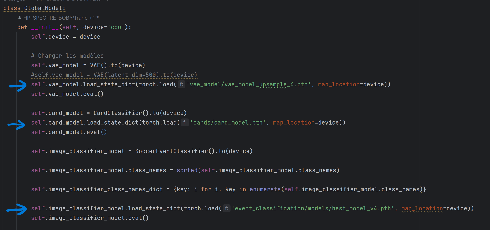

# Setup

- Installer Python (on a utilisé la version **3.12.10**)

- Créer et activer l'environement virtuel

`py -m venv .venv`

`.venv\Scripts\activate`

- Installer les packages du requirements.txt

`pip install -r requirements.txt`

source: https://packaging.python.org/en/latest/guides/installing-using-pip-and-virtual-environments/

- Créer le kernel et choisir l'environement virtuel depuis jupyter notebook

source: https://www.geeksforgeeks.org/using-jupyter-notebook-in-virtual-environment/

NB: J'ai du installer _ipython_ et _ipykernel_ avec ces commandes:

`pip install ipython`

`pip install ipykernel`

avant de rouler la commande de l'article:

`ipython kernel install --user --name=.venv`

# Entrainement des modèles

## VAE

- Télécharger les données ici: https://drive.google.com/drive/folders/1jzt7g0KqFNTshEAau95aScPWin55g31E

- Créer un dossier **train** dans le dossier **dataset** et y transférer les données d'entrainement des 7 catégories principales **(corner, free-kick, penalty, red-cards, tackle, to-subtitue, yellow-cards)**. On obtient cette hiérarchie:


- Ouvrir le notebook **vae_model/main.ipynb** et rouler le code pour entrainer un modèle VAE. Le modèle sera sauvegardé dans un fichier .pth. Ce fichier pourra être utilisé
ultérieurement pour l'évaluation du modèle global.

## Modèle de classification des evenements
### entrainement
- Télécharger les données ici: https://drive.google.com/drive/folders/1jzt7g0KqFNTshEAau95aScPWin55g31E

- Créer un dossier **train** dans un dossier de votre choix et transferer les y transférer les données d'entrainement des 10 catégories principales **(corner, free-kick, penalty, red-cards, tackle, to-subtitue, yellow-cards,left,center,right)**

- Ouvrir le notebook **event_classification/train.ipynb** et rouler le code pour entrainer le modele de Classification des évenements. Il vous sera demandé de fournir le chemin des données que vous voulez entraîner. Le modèle sera sauvegardé dans un fichier .pth. Ce fichier pourra être utilisé
ultérieurement pour l'évaluation du modèle global.

### entrainement
- Télécharger les données ici: https://drive.google.com/drive/folders/1jzt7g0KqFNTshEAau95aScPWin55g31E

- Créer un dossier **test** dans un dossier de votre choix et transferer les y transférer les données d'entrainement des 10 catégories principales **(corner, free-kick, penalty, red-cards, tackle, to-subtitue, yellow-cards,left,center,right)**

- Ouvrir le notebook **event_classification/model_eval.ipynb** et rouler le code pour entrainer le modele de Classification des évenements. Il vous sera demandé de fournir le chemin des données et le chemin du modèle que vous voulez tester qui se trouve dans **event_classification/models/** que vous voulez essayer (il y'en a 2).


## Modèle des cartons


Ce module permet de détecter et classifier automatiquement les cartons rouges et jaunes dans les images de matchs de football. Il utilise une architecture basée sur EfficientNetB0 combinée avec des modules OSME (One-Squeeze Multi-Excitation) et MAMC (Multi-Attention Multi-Class).

## Fonctionnalités

- Classification binaire des cartons (rouge/jaune) avec une précision de ~81% sur l'ensemble de test
- Visualisation des résultats avec matrices de confusion et graphiques comparatifs
- Architecture optimisée basée sur la recherche récente en classification fine d'images

## Prérequis

- Python 3.6+
- PyTorch 1.7+
- torchvision
- numpy
- matplotlib
- seaborn
- scikit-learn
- pandas
- opencv-python (cv2)

## Structure des données

Le module s'attend à une structure de dossiers spécifique pour les ensembles d'entraînement, de validation et de test:

```
dataset/
    train/
        carton_rouge/
        carton_jaune/
    validation/
        carton_rouge/
        carton_jaune/
    test/
        carton_rouge/
        carton_jaune/
```

Chaque sous-dossier doit contenir les images correspondant à la classe indiquée.

## Entraînement du modèle

Pour entraîner le modèle, exécutez le script `training_card_classifier.py`. Vous pouvez personnaliser l'entraînement avec différents paramètres:

```bash
python training_card_classifier.py [options]
```

### Options disponibles

```
--data_dir    Chemin vers le répertoire de données d'entraînement (défaut: "event detection project\dataset\train")
--val_dir     Chemin vers le répertoire de données de validation (défaut: "event detection project\dataset\validation")
--output      Chemin pour sauvegarder le modèle entraîné (défaut: "cards\card_model.pth")
--epochs      Nombre maximum d'époques d'entraînement (défaut: 60)
--batch_size  Taille de batch pour l'entraînement (défaut: 16)
--lr          Taux d'apprentissage (défaut: 0.001)
--patience    Patience pour early stopping (défaut: 5)
--val_split   Ratio de validation si pas de val_dir (défaut: 0.2)
```

### Exemple d'utilisation

```bash
python training_card_classifier.py --epochs 80 --batch_size 32 --lr 0.0005
```

Pendant l'entraînement, le script affichera la progression avec les métriques d'accuracy et de perte pour chaque époque. À la fin de l'entraînement, un graphique d'historique d'entraînement sera sauvegardé dans `training_history.png`.

## Évaluation du modèle

Pour évaluer les performances du modèle sur l'ensemble de validation ou de test, utilisez le script `evaluate_card_model.py`:

```bash
python evaluate_card_model.py
```

Par défaut, le script utilise les chemins suivants:

```python
MODEL_PATH = "cards\card_model.pth"
VAL_DIR = "event detection project\dataset\validation"
TEST_DIR = "event detection project\dataset\test"
PAPER_ACCURACY = 79.90  # Précision de référence de l'article original
```

Pour personnaliser l'évaluation, modifiez ces variables dans le script ou passez-les en arguments si vous adaptez le script.

Le script générera deux visualisations importantes:
1. Un graphique comparant la précision globale et par classe
2. Une matrice de confusion détaillant les prédictions correctes et incorrectes

## Note sur le module d'attention couleur

Le module d'attention couleur (`EnhancedColorAttention`) a été désactivé dans l'implémentation actuelle car nos expériences ont montré qu'il n'apportait pas d'amélioration significative aux performances du modèle. Si vous souhaitez réactiver cette fonctionnalité, vous pouvez décommenter les lignes pertinentes dans la méthode `forward` de la classe `CardClassifier` dans `card_classifier.py`:


```python
# Remplacer:
# SKIP color attention and use features directly
# enhanced_features, red_attention, yellow_attention = self.color_attention(features)
dummy_red_attention = torch.ones_like(features[:, :1, :, :])
dummy_yellow_attention = torch.ones_like(features[:, :1, :, :])
outputs, attention_features, attention_maps = self.osme_mamc(features)

# Par:
enhanced_features, red_attention, yellow_attention = self.color_attention(features)
outputs, attention_features, attention_maps = self.osme_mamc(enhanced_features)
```

## Fichiers principaux

- `card_classifier.py`: Définit l'architecture du modèle et contient la classe `CardDetector`
- `training_card_classifier.py`: Script d'entraînement du modèle
- `evaluate_card_model.py`: Script d'évaluation et de visualisation des performances


# Evaluation du modèle global

- Créer un dossier **test** dans le dossier **dataset** et y transférer la totalité des données de test récupérés ici: https://drive.google.com/drive/folders/1jzt7g0KqFNTshEAau95aScPWin55g31E. On obtient cette hiérarchie:


- Consulter le fichier **global_model.py** et s'assurer que les fichiers des modèles sont bien référencés



- Rouler le notebook **main.ipynb** à la racine pour évaluer le modèle global
